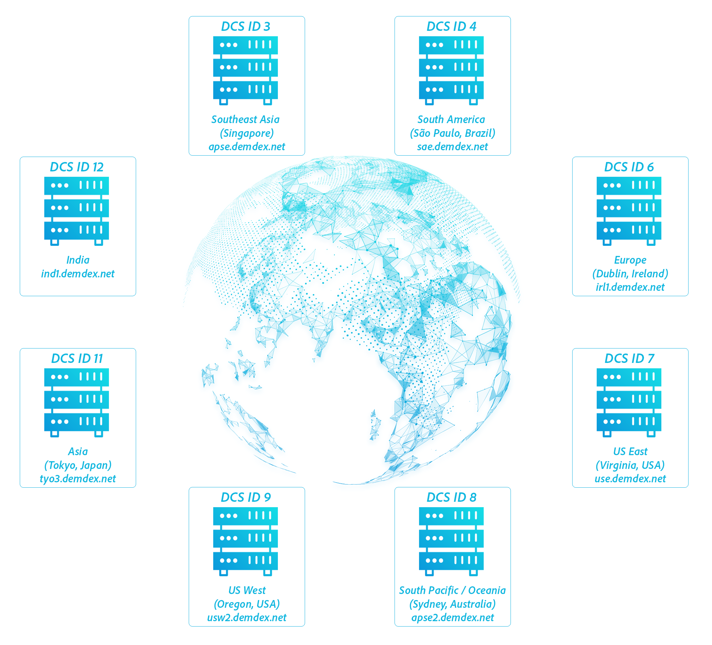

# Composants de la collecte de données{#data-collection-components}

Les composants de collecte de données incluent les serveurs de collecte de données, l’API DIL, les transferts de données entrants serveur à serveur et les fichiers journaux.

<!-- 

c_compcollect.xml

 -->

Audience Manager contient les composants de collecte de données suivants :

* [Serveurs de collecte de données (DCS) et serveurs de cache de profils (PCS)](../../reference/system-components/components-data-collection.md#dcs-pcs)
* [Bibliothèque d’intégration des données (DIL)](../../reference/system-components/components-data-collection.md#dil)
* [Réception serveur à serveur](../../reference/system-components/components-data-collection.md#inbound-outbound-server)
* [Fichiers journaux](../../reference/system-components/components-data-collection.md#log-files)

## Serveurs de collecte de données (DCS) et serveurs de cache de profils (PCS) {#dcs-pcs}

Le serveur de collecte de données et le service de collecte de données travaillent ensemble et fournissent séparément des services liés à la réalisation des caractéristiques, à la segmentation des audiences et au stockage des données.

Fonction **[!UICONTROL Data Collection Servers (DCS)]**

En [!DNL Audience Manager], le serveur de collecte de données :

* Reçoit et évalue les données de caractéristique d’un appel d’événement. Cela inclut les informations utilisées pour la segmentation en temps réel et les données transmises à intervalles planifiés par des transferts de serveur à serveur.
* Segmente les utilisateurs en fonction de leurs caractéristiques réalisées et des règles de qualification que vous créez avec le [créateur de segments](../../features/segments/segment-builder.md).
* Crée et gère les identifiants d’appareil et de profil authentifiés. Cela inclut des identifiants tels que les identifiants de fournisseur de données, d’utilisateur, d’identité déclarée, les codes d’intégration, etc.
* Recherche sur le PC les caractéristiques supplémentaires qu’un utilisateur a déjà obtenues avant un appel d’événement en temps réel. Cela permet au serveur de collecte de données de qualifier les utilisateurs en fonction des données en temps réel et des données historiques.
* Écrit des fichiers journaux et les envoie aux systèmes d’analyse pour stockage et traitement.

**[!DNL DCS]Gère La Demande Via[!UICONTROL Global Server Load Balancing (GSLB)]**

Le [!DNL DCS] est un système distribué géographiquement et à charge équilibrée. Cela signifie que [!DNL Audience Manager] pouvez diriger les requêtes vers et depuis un centre de données régional en fonction de l’emplacement géographique d’un visiteur du site. Cette stratégie permet d’améliorer les temps de réponse, car une réponse [!DNL DCS] est envoyée directement à un centre de données qui contient des informations sur ce visiteur. [!UICONTROL GSLB] rend notre système efficace parce que les données pertinentes sont mises en cache dans les serveurs les plus proches de l&#39;utilisateur.

>[!IMPORTANT]
>
>Le [!DNL DCS] détecte uniquement le trafic web provenant d’appareils qui utilisent IPv4.

Dans un appel d’événement, l’emplacement géographique est capturé dans une paire clé-valeur renvoyée dans un corps plus grand de données JSON. Cette paire clé-valeur est le paramètre `"dcs_region": region ID`.

En tant que client, vous interagissez avec le [!DNL DCS] indirectement par le biais de notre code de collecte de données. Vous pouvez également travailler directement avec le [!DNL DCS] par le biais d’un ensemble d’API. Voir [&#x200B; Méthodes et code de l’API Data Collection Server (DCS)](../../api/dcs-intro/dcs-event-calls/dcs-event-calls.md).

**[!UICONTROL Profile Cache Servers (PCS)]**

Le [!UICONTROL PCS] est une base de données volumineuse (en fait, un énorme cookie côté serveur). Il stocke les données reçues pour les utilisateurs actifs provenant des transferts serveur à serveur et du [!DNL DCS]. [!UICONTROL PCS] données se composent d’identifiants d’appareil et de profil authentifié, ainsi que des caractéristiques qui leur sont associées. Lorsque l’[!DNL DCS] reçoit un appel en temps réel, il vérifie l’[!UICONTROL PCS] pour d’autres caractéristiques auxquelles un utilisateur peut appartenir ou pour lesquelles il peut être éligible. De plus, si une caractéristique est ajoutée à un segment plus tard, ces identifiants de caractéristique sont ajoutés au [!UICONTROL PCS] et les utilisateurs peuvent se qualifier pour ce segment automatiquement, sans avoir à se rendre sur un site ou une application spécifique. Le [!UICONTROL PCS] permet aux [!DNL Audience Manager] de mieux comprendre vos utilisateurs, car il peut faire correspondre et segmenter les utilisateurs en temps réel ou en arrière-plan avec de nouvelles données historiques sur les caractéristiques. Ce comportement vous donne une image plus complète et plus précise de vos utilisateurs qu’à partir des qualifications en temps réel seules.

Il n’existe aucune commande de l’interface utilisateur qui permet à nos clients de travailler directement avec le [!UICONTROL PCS]. L’accès des clients au [!UICONTROL PCS] est indirect, par le biais de son rôle de magasin de données et de transferts de données. Le [!UICONTROL PCS] s’exécute sur Apache Cassandra.

**Purge des ID inactifs du[!UICONTROL PCS]**

Comme indiqué précédemment, le [!UICONTROL PCS] stocke les identifiants de caractéristique pour les utilisateurs actifs. Un utilisateur actif est tout utilisateur qui a été vu par les [serveurs de données Edge](../../reference/system-components/components-edge.md) depuis n’importe quel domaine au cours des 14 derniers jours. Ces appels au [!UICONTROL PCS] maintiennent un utilisateur dans un état actif :

* [!DNL /event] appels
* Appels [!DNL /ibs] (synchronisations des identifiants)

<!-- 

Removed /dpm calls from the bulleted list. /dpm calls have been deprecated.

 -->

Le [!UICONTROL PCS] vide les caractéristiques si elles sont inactives pendant 17 jours. Ces caractéristiques ne sont toutefois pas perdues. Elles sont stockées dans Hadoop. Si l’utilisateur est revu à un autre moment, Hadoop renvoie toutes ses caractéristiques au [!UICONTROL PCS], généralement dans un délai de 24 heures.

**Autres processus de [!UICONTROL DCS/PCS] : désinscription de la confidentialité**

Ces systèmes de serveur gèrent les demandes de confidentialité et de désinscription des utilisateurs. Les informations de cookie utilisateur ne sont pas collectées dans le fichier journal si un utilisateur s’est opposé à la collecte de données. Pour plus d’informations sur nos politiques de confidentialité, consultez le [Centre de traitement des données personnelles &#x200B;](https://www.adobe.com/fr/privacy/experience-cloud.html).

## Bibliothèque d’intégration de données (DIL) {#dil}

[!UICONTROL DIL] code que vous placez sur la page pour la collecte de données. Consultez la section [API &#x200B;](../../dil/dil-overview.md) pour plus d’informations sur les services et méthodes disponibles.

## Réception serveur à serveur {#inbound-outbound-server}

Il s’agit de systèmes qui reçoivent des données envoyées par diverses intégrations serveur à serveur avec nos clients. Pour plus d’informations, consultez la documentation sur l’[envoi des données d’audience](/help/using/integration/sending-audience-data/real-time-data-integration/real-time-tech-specs.md).

## Fichiers journaux {#log-files}

Le [!UICONTROL PCS] crée et écrit des données dans les fichiers journaux. Ils sont envoyés à d’autres systèmes de base de données pour traitement, création de rapports et stockage.

>[!MORELIKETHIS]
>
>* [Centre de traitement des données personnelles Adobe](https://www.adobe.com/fr/privacy.html)
