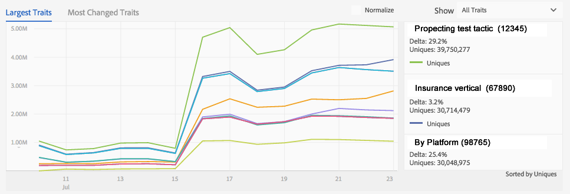
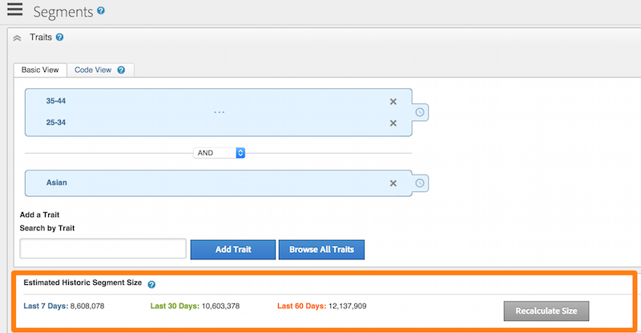
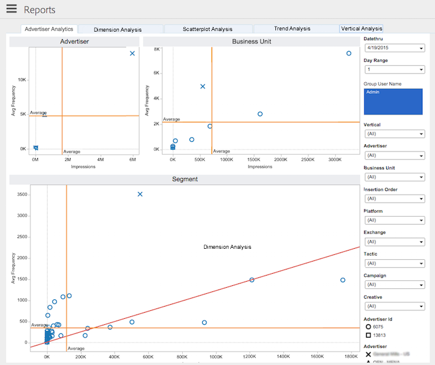

# Composants de traitement de données{#data-processing-components}

Les composants de traitement de données incluent Hadoop, Snowflake, SOLR et Tableau.

<!-- 

c_comproc.xml

 -->

Audience Manager utilise les composants suivants pour traiter les données :

## Hadoop {#hadoop}

En [!DNL Audience Manager], Hadoop est la base de données principale qui contient tout ce que [!DNL Audience Manager] savez sur un utilisateur. Par exemple, lorsque les [Serveurs de cache de profil](../../reference/system-components/components-data-collection.md) créent des fichiers journaux contenant des données sur vos utilisateurs, ils envoient ces données à Hadoop pour stockage. Voici d’autres éléments importants d’Hadoop :

* **Ruche :** un entrepôt de données pour Hadoop. Hive gère les requêtes ad hoc sur les données stockées dans Hadoop.

* **HBase :** base de données Hadoop très volumineuse. Il traite et gère les données entrantes et sortantes, les règles de caractéristiques, les informations de modélisation algorithmique et exécute de nombreuses autres fonctions liées au stockage et au déplacement des données vers différents systèmes.

Les clients n’ont pas d’accès direct à ces systèmes. Cependant, les clients travaillent avec eux indirectement, car ces composants stockent des données importantes sur les visiteurs de leur site.

## Snowflake {#snowflake}

[&#128279;](https://www.snowflake.net/) est une base de données cloud volumineuse. Il fournit des données à de nombreux graphiques de tableaux de bord et aux zones de texte associées qui affichent le pourcentage de modification pour chaque élément du graphique. Si vous utilisez [!DNL Audience Manager] et consultez les rapports de tableau de bord, vous interagissez avec les données fournies par [!UICONTROL Snowflake].

Il ne s’agit en aucun cas d’une liste complète, mais certains rapports de tableau de bord courants dont [!UICONTROL Snowflake] est responsable incluent :

* [Rapport de variation des caractéristiques quotidiennes](/help/using/reporting/audience-optimization-reports/daily-trait-variation-report.md)
* Tous les rapports de chevauchement (voir la section [&#x200B; Rapports interactifs &#x200B;](/help/using/reporting/dynamic-reports/dynamic-reports.md) pour plus d’informations sur chaque rapport de chevauchement).
* [Rapport Signaux inutilisés](/help/using/reporting/dynamic-reports/unused-signals.md)

## SOLR {#solr}

SOLR est un système de serveur et de base de données open source d’Apache. Il offre des fonctionnalités de recherche robustes et rapides sur nos grands ensembles de données. En tant que client [!DNL Audience Manager], vous pouvez voir SOLR en action lorsque vous créez des segments. Il fournit des données au rapport [!UICONTROL Estimated Historic Segment Size]. SOLR est idéal pour ce rôle en raison de sa vitesse. Par exemple, SOLR peut mettre à jour les données de taille historiques au fur et à mesure que vous créez des règles et ajoutez de nouvelles caractéristiques à un segment.

## Tableau {#tableau}

[!DNL Audience Manager] utilise [Tableau](https://www.tableausoftware.com/) pour afficher les données dans les [rapports interactifs](../../reporting/dynamic-reports/dynamic-reports.md#interactive-and-overlap-reports) et les [rapports Audience Optimization](../../reporting/audience-optimization-reports/audience-optimization-reports.md). Les rapports interactifs affichent les performances et les données de chevauchement pour les caractéristiques et les segments. Au lieu d’utiliser des nombres disposés en colonnes et en lignes, ils renvoient des données en utilisant différentes formes, couleurs et tailles. De plus, vous pouvez choisir des points de données individuels ou par groupes et analyser en profondeur les résultats du rapport pour obtenir plus de détails. Ces techniques de visualisation et l’interactivité des rapports permettent de comprendre plus facilement de grandes quantités de données numériques.

