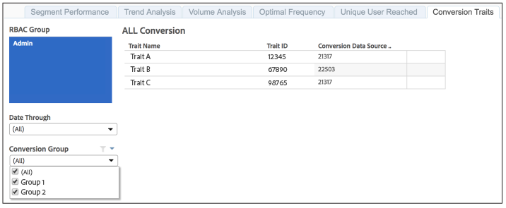

# Caractéristiques de conversion signalées{#reported-conversion-traits}

Le rapport Caractéristiques de conversion vous présente toutes les caractéristiques étiquetées comme caractéristiques de conversion pour un groupe de conversion à une certaine date.

Les caractéristiques de conversion des groupes de conversion peuvent passer d’une exécution de création de rapports à une exécution de création de rapports. Le rapport affiche les caractéristiques de conversion par groupe de conversion pour la date de création de rapports sélectionnée.

Pour découvrir comment créer des caractéristiques de conversion dans Audience Manager, regardez la vidéo ci-dessous :

>[!VIDEO](https://video.tv.adobe.com/v/328076?captions=fre_fr)

## Exemple de rapport

Votre rapport [!UICONTROL Reported Conversion Traits] pourrait ressembler à celui ci-dessous :

