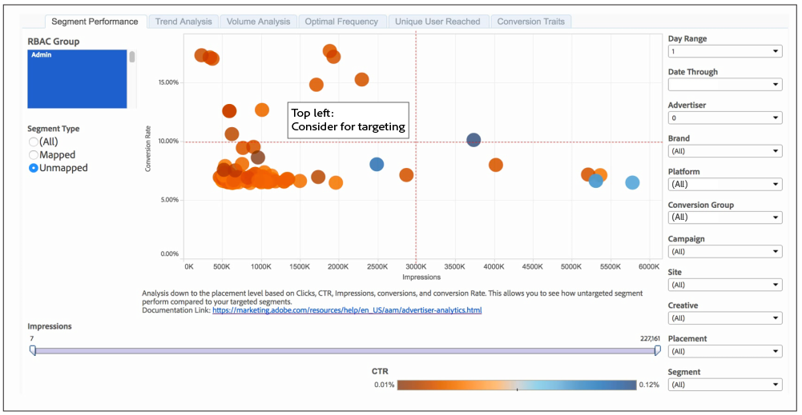

# Segment Performance Report{#segment-performance-report}

The [!UICONTROL Segment Performance] report compares mapped and unmapped segments by impressions and conversion rates. Un segment mappé est un segment que vous créez et envoyez à une destination pour le ciblage. Un segment non mappé est un segment que vous avez créé mais que vous n'avez pas envoyé à une destination pour le ciblage. La comparaison de ces différents types de segments dans et entre les rapports permet d'optimiser les campagnes existantes et de rechercher des segments ignorés que vous souhaitez envoyer à une destination pour le ciblage.

## How to Read Your Mapped Segment Results {#read-mapped-segment-results}

The mapped [!UICONTROL Segment Performance] report displays all the segments you created and sent to a destination for targeting.The position of your mapped segments in a report can tell you a lot about which segments are performing well and where you might need to make some adjustments.

Pour lire le rapport, il permet de diviser les résultats en 4 sections avec des lignes imaginaires (en rouge) et des catégories illustrées dans l'exemple de rapport ci-dessous.

Les étiquettes dans l'exemple et le tableau suivant peuvent vous aider à comprendre les performances des segments et comment réagir à ces résultats.

<table id="table_A29253B30DFA4CD7B3B7C320DE0BDEA4"> 
 <thead> 
  <tr> 
   <th colname="col1" class="entry"> Position </th> 
   <th colname="col2" class="entry"> Emplacement indiqué </th> 
  </tr> 
 </thead>
 <tbody> 
  <tr> 
   <td colname="col1"> 
 <b>Haut gauche</b> 
 </td> 
   <td colname="col2"> 
De bons taux de conversion. 
 
Vous pouvez obtenir davantage de conversions en augmentant les impressions. 
 </td> 
  </tr> 
  <tr> 
   <td colname="col1"> 
 <b>Bas gauche</b> 
 </td> 
   <td colname="col2"> 
Taux de conversion faibles. 
 
Vous pouvez éviter de cibler ces segments. Les segments de cette section génèrent de grands candidats pour comparaison avec ceux des résultats non mappés. Certains de vos segments non mappés peuvent être plus performants que les segments que vous ciblez déjà. 
 </td> 
  </tr> 
  <tr> 
   <td colname="col1"> 
 <b>Haut droite</b> 
 </td> 
   <td colname="col2"> 
Performances élevées. Laissez ces segments seul. 
 </td> 
  </tr> 
  <tr> 
   <td colname="col1"> 
 <b>Bas droite</b> 
 </td> 
   <td colname="col2"> 
Taux de conversion faibles et impressions élevées. 
 
Les segments de cette section ne sont pas performants. Vous pouvez décaler le budget hors de ces segments et en segments dans le quadrant supérieur gauche du rapport. Cela contribue à réduire les impressions et peut contribuer à améliorer les taux de conversion des segments dans cette section inférieure droite. Comparez également ces segments mappés aux segments non mappés. Certains de vos segments non mappés peuvent être plus performants que les segments que vous ciblez déjà. 
 </td> 
  </tr> 
 </tbody> 
</table>

## How to Read Your Unmapped Segment Results {#read-unmapped-segment-results}

Looking at unmapped segments in a [!UICONTROL Segment Performance] report is a great way to find new segments you haven't considered for targeting. En fait, certains de ces segments peuvent dépasser les segments mappés. Ceci est dû au fait qu'un segment non mappé doit respecter un jeu de critères de qualification à inclure dans ce rapport. Pour être inclus dans ce rapport, un segment non mappé doit :

* Avec des conversions supérieures à la moyenne de tous les segments mappés.
* Utilisez les 100 segments non mappés par taux de conversion.

Pour lire ce rapport, il permet de diviser les résultats en 4 sections avec des lignes imaginaires (en rouge) et des catégories illustrées dans l'exemple de rapport ci-dessous.

Dans ce rapport, vous souhaitez simplement vous concentrer sur ces segments non mappés dans la section supérieure gauche. Ces segments non mappés présentent des taux de conversion élevés pour un faible niveau d'impressions comparé aux segments dans les trois autres sections.

>[!NOTE]
>
>7-day and 30-day look-back periods are only available for Sunday **[!UICONTROL Date Through]** dates.
