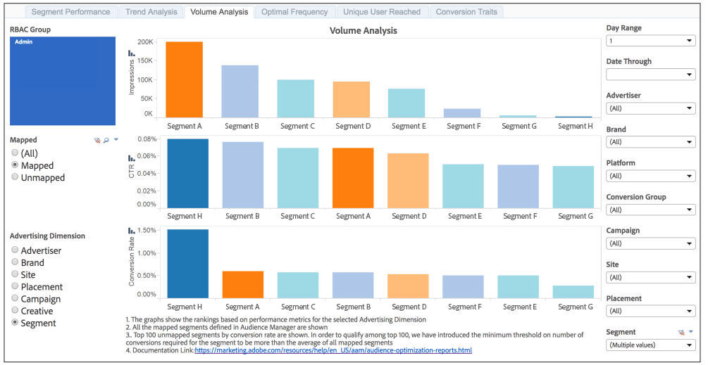

# Rapports [!UICONTROL Trend Analysis] et [!UICONTROL Volume Analysis]{#trend-analysis-and-volume-analysis-reports}

Ces rapports renvoient des données sur les impressions, les taux de clic publicitaire et les conversions pour un large éventail de dimensions publicitaires. Comparez les tendances et le volume des mesures sélectionnées afin d’obtenir une meilleure vue d’ensemble des performances de votre campagne au fil du temps.

## Exemple de rapport [!UICONTROL Trend Analysis] {#sample-trend-analysis}

Le rapport [!UICONTROL Trend Analysis] renvoie des données dans un graphique linéaire pour un intervalle de 14 jours uniquement. Dans cet exemple, le rapport affiche les tendances d’impression, de clic publicitaire et de conversion pour un ensemble de segments mappés.

## Exemple de rapport [!UICONTROL Volume Analysis] {#sample-volume-analysis}

Le rapport [!UICONTROL Volume Analysis] renvoie des données sous forme de graphique à barres pour la période sélectionnée. Dans cet exemple, le rapport affiche les impressions, les clics publicitaires et les conversions en volume pour un ensemble de segments mappés.

>[!NOTE]
>
>Les périodes de recherche en amont de 7 jours et 30 jours ne sont disponibles que pour les dates du dimanche **[!UICONTROL Date Through]**.

>[!TIP]
>
>Pour plus d’informations sur les segments mappés et non mappés, consultez la documentation [Rapport sur les performances des segments](../../../reporting/audience-optimization-reports/aor-advertisers/segment-performance.md).
