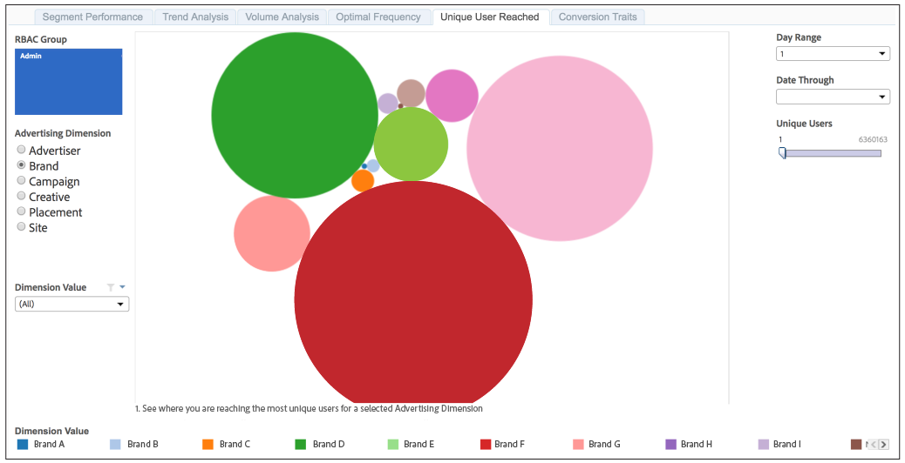

# Unique User Reach{#unique-user-reach}

Le rapport Portée d’un utilisateur unique renvoie des données dans un graphique à bulles. Chaque bulle est dimensionnée en proportion directe du nombre d’utilisateurs uniques pour la dimension sélectionnée. Une bulle plus grande indique une plus grande portée qu&#39;une bulle plus petite.

Le rapport Portée d’utilisateur unique vous permet de trouver l’annonceur, la marque, la campagne, le contenu créatif, l’emplacement ou le site qui offre la portée la plus large contre vos utilisateurs ciblés.

>[!NOTE]
>
>Gardez à l’esprit que :
>
>* Le rapport [!UICONTROL Unique User Reach] affiche des informations uniquement pour les utilisateurs disposant de niveaux d’autorisation [!UICONTROL Admin]. Votre consultant [!DNL Audience Manager] ou l’assistance clientèle peut configurer votre compte avec des autorisations [!UICONTROL Admin].
>
>* Les périodes de recherche en amont de 7 jours et 30 jours ne sont disponibles que le dimanche.

## Exemple de rapport

Votre rapport [!UICONTROL Unique User Reach] pourrait ressembler à celui ci-dessous. Dans votre rapport, cliquez sur une bulle pour afficher les données sous-jacentes.

