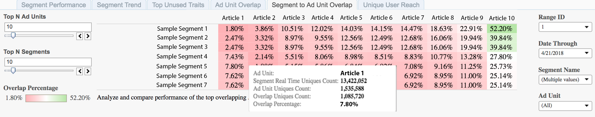

# Chevauchement de segments et d’unités publicitaires{#segment-to-ad-unit-overlap}

Le rapport Chevauchement des segments et des unités publicitaires s’affiche sous la forme d’un graphique thermique qui met en évidence les chevauchements importants et faibles entre vos unités publicitaires et les segments Audience Manager.

## Cas d’utilisation {#use-cases}

Le rapport [!UICONTROL Segment to Ad Unit Overlap] vous permet de comprendre quelles audiences visitent vos propriétés web. Le rapport affiche le chevauchement entre les membres de vos segments de [!DNL Audience Manager] et le nombre de visiteurs sur vos propriétés web. Un chevauchement plus élevé signifie que de nombreux membres d’un segment visitent votre propriété web.

## Utilisation du rapport de chevauchement des segments et des unités {#using-the-report}

Utilisez les commandes **[!UICONTROL Top N Ad Units]** et **[!UICONTROL Top N Segments]** pour sélectionner le nombre d’unités publicitaires et de segments de votre choix pour le chevauchement. Vous pouvez sélectionner un nombre maximal de 100 éléments pour chacun.

Utilisez les commandes **Plage de jours** et **Période** pour ajuster votre plage d’analyse. Notez que les périodes d’analyse de 7 jours et de 30 jours ne sont disponibles que pour les dates du dimanche.

Utilisez les zones **[!UICONTROL Segment Name]** et **[!UICONTROL Ad Unit]** pour filtrer n’importe quel segment ou unité publicitaire.

>[!IMPORTANT]
>
>Lors de l’activation de [!UICONTROL Audience Optimization for Publishers], vous devez inclure des métadonnées descriptives pour [!UICONTROL Ad Unit IDs], comme décrit à l’étape 3 de la section [Importer des fichiers de données Google Ad Manager (anciennement DFP) dans Audience Manager](../../../reporting/audience-optimization-reports/aor-publishers/import-dfp.md). Ce faisant, vous vous assurez que le rapport détaille la propriété web comme [!UICONTROL Ad Unit] au lieu de la [!UICONTROL Ad Unit ID].

## Interprétation des résultats {#interpreting-results}

Votre rapport [!UICONTROL Segment to Ad Unit Overlap] pourrait ressembler à celui ci-dessous. Pointez sur une cellule pour obtenir plus d’informations sur ce chevauchement particulier. Voir les descriptions pour les informations supplémentaires dans le tableau sous l’exemple de rapport.

<table id="table_22340F45B1B94D3796174CB30A60E212"> 
 <thead> 
  <tr> 
   <th colname="col1" class="entry"> Élément </th> 
   <th colname="col2" class="entry"> Description </th> 
  </tr>
 </thead>
 <tbody> 
  <tr> 
   <td colname="col1"> 
 de l’unité publicitaire  
 </td> 
   <td colname="col2"> 
Nom de l'article en stock. Il peut s’agir, par exemple, de l’un de vos sites web ou d’un article sur votre site web. 
 </td> 
  </tr> 
  <tr> 
   <td colname="col1"> 
Nombre ’Unités En Temps Réel Du Segment  
 </td> 
   <td colname="col2"> 
Nombre de visiteurs et visiteuses uniques vus en temps réel pour la période spécifiée et qui étaient qualifiés pour le segment au moment où ils ont été vus par  Audience Manager. 
 </td> 
  </tr> 
  <tr> 
   <td colname="col1"> 
Nombre ’Unités publicitaires uniques 
 </td> 
   <td colname="col2"> 
Nombre de visiteurs et visiteuses pour cette entité publicitaire spécifique. Ces informations sont extraites des journaux Google Ad Manager. 
 </td> 
  </tr> 
  <tr> 
   <td colname="col1"> 
 nombre d’uniques de chevauchement 
 </td> 
   <td colname="col2"> 
Membres de votre segment qui ont été exposés à l’élément d’annonce publicitaire. 
 </td> 
  </tr> 
  <tr> 
   <td colname="col1"> 
 pourcentage de chevauchement 
 </td> 
   <td colname="col2"> 
Chevauchement entre les populations d’unités publicitaires et de segments. Il s’agit du nombre d’uniques de chevauchement  exprimé en pourcentage des uniques en temps réel du segment . 
 </td> 
  </tr> 
 </tbody> 
</table>
