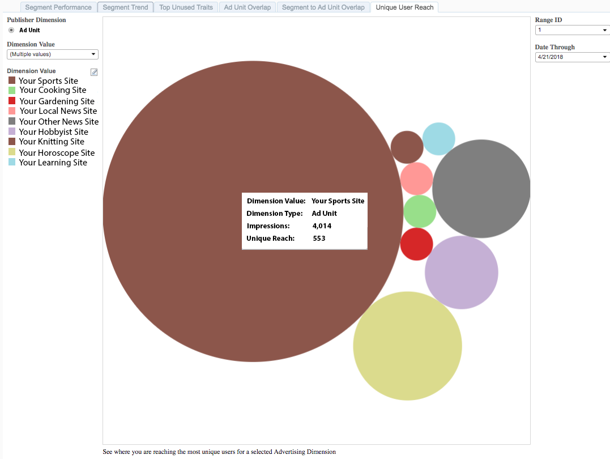

# Unique User Reach{#unique-user-reach}

Le rapport Portée d’un utilisateur unique renvoie des données dans un graphique à bulles. Chaque bulle est dimensionnée en proportion directe du nombre d’utilisateurs uniques pour les annonces publicitaires sélectionnées. Une bulle plus grande indique une plus grande portée qu&#39;une bulle plus petite. Le rapport Portée de l’utilisateur unique vous permet de trouver l’entité publicitaire qui offre la portée la plus large contre vos utilisateurs ciblés.

## Cas d’utilisation {#use-cases}

Le rapport [!UICONTROL Unique User Reach] vous permet d’identifier les propriétés de votre portefeuille qui attirent un grand nombre d’utilisateurs uniques.

## Utilisation du rapport d’étendue unique {#using-the-report}

Utilisez la boîte de **[!UICONTROL Dimension Value]** pour sélectionner les unités publicitaires à afficher dans le rapport. Cliquez sur **[!UICONTROL All]** pour afficher toutes vos propriétés dans le graphique à bulles.

Utilisez les commandes **Plage de jours** et **Période** pour ajuster votre plage d’analyse.

## Interprétation des résultats {#interpreting-results}

**Exemple de rapport**

Votre rapport [!UICONTROL Unique User Reach] pourrait ressembler à celui ci-dessous. Dans votre rapport, cliquez sur une bulle pour afficher les données sous-jacentes. Voir les descriptions pour obtenir des informations supplémentaires dans le tableau ci-dessous.

| Élément | Description |
|--- |--- |
| Valeur Dimension | Nom de votre propriété web. |
| Type de Dimension | Type de dimension d’éditeur. Actuellement, nous ne prenons en charge que l’Ad Unit en tant que type de dimension. |
| Impressions | Nombre d’impressions générées pour votre propriété web dans la plage d’analyse spécifiée. |
| Portée unique | Nombre unique d’utilisateurs et d’utilisatrices qui ont été touchés par les impressions sur vos propriétés web. |
