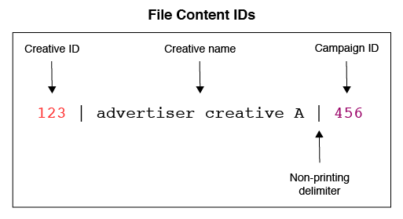

# Présentation et mappages des fichiers de métadonnées{#overview-and-mappings-for-metadata-files}

Un fichier de métadonnées lie des ID numériques avec des noms lisibles et compréhensibles. Les rapports Optimisation des Audiences affichent des noms lisibles dans les différents menus d&#39;options de rapport.

## Aperçu {#overview}

Examen des métadonnées et de leur utilisation. Un fichier de métadonnées doit être accompagné d’un fichier de données. Le contenu du fichier de métadonnées correspond aux informations relatives au fichier de données et aux étiquettes lisibles dans les menus du rapport. Pour plus d’informations, voir Fichiers de [données pour les rapports d’optimisation des Audiences et Fichiers journaux](../../../reporting/audience-optimization-reports/metadata-files-intro/datafiles-intro.md)utilisables.

### Les Fichiers De Métadonnées Contiennent Des Données Sur D’Autres Données

Un fichier de métadonnées contient des informations sur d’autres types de données. Pour vous aider à comprendre comment cela fonctionne, examinons comment [!DNL Audience Manager] reçoit les données.

Au cours d’un événement d’impression ou de clic, [!DNL Audience Manager] reçoit des données dans une chaîne URL appelée appel **&#x200B;événement.

L&#39;appel de événement classe les informations en ensembles de paires clé-valeur définies. Les valeurs d’une paire clé-valeur contiennent des données numériques. Le fichier de métadonnées contient des noms et d’autres informations lisibles correspondant à l’identifiant dans chaque paire clé-valeur.

### Les identifiants des liens de métadonnées aux noms lisibles

Le fichier de métadonnées est nécessaire pour lier un ID numérique à un nom lisible. Par exemple, un appel de événement contient un identifiant créatif dans une paire clé-valeur telle que celle-ci : `d_creative:1234`. Sans fichier de métadonnées, ce créatif apparaîtrait sous la forme 1234 dans un menu d’options.

Cependant, un fichier de métadonnées correctement formaté peut lier ce créatif à un nom réel tel que &quot;Advertiser Creative A&quot;, nom que vous pouvez lire et reconnaître dans un rapport.

### Quand avez-vous besoin d’un fichier de métadonnées

Tout d&#39;abord, un fichier de métadonnées et tous les paramètres répertoriés ci-dessous sont requis dans un appel de événement lorsque vous souhaitez utiliser les rapports [Optimisation des](../../../reporting/audience-optimization-reports/audience-optimization-reports.md)Audiences.

Ensuite, vous avez besoin d&#39;un fichier de métadonnées si vous envoyez vos propres données à [!DNL Audience Manager] ou si vous souhaitez afficher les données des rapports d&#39;autres fournisseurs avec lesquels nous ne sommes pas intégrés. Par exemple, [!DNL Audience Manager] dispose d’une intégration avec le Gestionnaire [de Campaign (DCM) de Google avec un](../../../reporting/audience-optimization-reports/aor-advertisers/import-dcm.md) Doublon-clic. En raison de cette relation, [!DNL Audience Manager] vous pouvez associer des identifiants aux noms et descriptions utilisés par les options de rapport. Sans intégration, nous pouvons toujours ingérer des données, mais les options de rapport afficheront des identifiants numériques au lieu d’un nom descriptif.

## Correspondances de fichiers {#file-mappings}

Le tableau suivant liste les paires clé-valeur qui contiennent les données utilisées par les [!UICONTROL Audience Optimization] rapports. Si vous devez utiliser un fichier de métadonnées, il contiendra des informations lisibles qui correspondent aux valeurs de ces paires clé-valeur. Les valeurs de ces clés acceptent des entiers uniquement (type de données INT). Note, *italics* indicates a variable placeholder. Les autres éléments sont des constantes ou des clés et ne changent pas.

>[!IMPORTANT]
>
>Si vous utilisez les [!UICONTROL Audience Optimization] rapports, *toutes* ces valeurs sont requises dans l’appel de événement.

<table id="table_B2C8C493080E449CA71C4EF07D9476BD"> 
 <thead> 
  <tr> 
   <th colname="col1" class="entry"> Option de rapport </th> 
   <th colname="col2" class="entry"> Paires clé-valeur des métadonnées </th> 
  </tr> 
 </thead>
 <tbody> 
  <tr> 
   <td colname="col1"> 
Annonceur 
 </td> 
   <td colname="col2"> 
 <code>d_adsrc = <i>data source ID or integration code</i></code> 
 
Il s’agit de l’ID de source de données ou du code d’intégration de l’annonceur fourni lors de la création d’une source de données. Voir <a href="../../../features/manage-datasources.md#create-data-source"> Création d’une source</a>de données. 
 </td> 
  </tr> 
  <tr> 
   <td colname="col1"> 
Unité opérationnelle 
 </td> 
   <td colname="col2"> 
 <code>d_bu = <i>business unit ID</i></code> 
 </td> 
  </tr> 
  <tr> 
   <td colname="col1"> 
Campagne 
 </td> 
   <td colname="col2"> 
 <code>d_campaign = <i>campaign ID</i></code> 
 </td> 
  </tr> 
  <tr> 
   <td colname="col1"> 
Créatif 
 </td> 
   <td colname="col2"> 
 <code>d_creative = <i>creative ID</i></code> 
 </td> 
  </tr> 
  <tr> 
   <td colname="col1"> 
Exchange 
 </td> 
   <td colname="col2"> 
Accepte 2 paires clé-valeur différentes : 
 
    <ul id="ul_3B3B751A8A134096B0912E81A0983B9D"> 
     <li id="li_57BAC45A7B274AB695945E174A4D8A35"> <code>d_exchange = <i>ID for the exchange that served the ad</i></code> </li> 
     <li id="li_CCDF00DE59D3451C8EF590DD3E1A806D"> <code>d_site = <i>ID for the site an ad served on</i></code> </li> 
    </ul> </td> 
  </tr> 
  <tr> 
   <td colname="col1"> 
Ordre d’insertion (E/S) 
 </td> 
   <td colname="col2"> 
 <code>d_io = <i>insertion order ID</i></code> 
 </td> 
  </tr> 
  <tr> 
   <td colname="col1"> 
Plate-forme 
 </td> 
   <td colname="col2"> 
 <code>d_src = <i>data source ID</i></code> 
 
Il s’agit de l’ID de source <a href="../../../features/datasources-list-and-settings.md#data-sources-list-and-settings"> de données</a> pour la plateforme fournissant des informations de métadonnées (par exemple, DFA, Atlas, GBM, MediaMath, etc.). 
 </td> 
  </tr> 
  <tr> 
   <td colname="col1"> 
Tactique 
 </td> 
   <td colname="col2"> 
 <code>d_tactic = <i>tactic ID</i></code> 
 </td> 
  </tr> 
  <tr> 
   <td colname="col1"> 
Vertical 
 </td> 
   <td colname="col2"> 
 <code>d_vert = <i>vertical ID</i></code> 
 </td> 
  </tr> 
 </tbody> 
</table>

## Comment les ID d&#39;appel de Événement façonnent les noms de fichier, le contenu et les chemins de Diffusion {#how-ids-shape-file-names}

Les identifiants transmis par ces paires clé-valeur permettent de créer le nom du fichier de métadonnées et son contenu. Les sections et illustrations ci-après montrent comment cela fonctionne. Ces exemples créent un fichier qui contient le nom d’un élément créatif dans une campagne, mais d’autres combinaisons sont possibles.

### Appel Événement

Dans cet exemple, nous allons créer un fichier de métadonnées qui introduit des noms créatifs dans un [!UICONTROL Audience Optimization] rapport. Pour ce faire, nous devons extraire des ID de source de données, de campagne et de création à partir d’un appel de événement.

### Nom de fichier

Le nom de fichier est basé sur les ID de création, de campagne et de source de données. Dans ce cas, comparez ici les différences entre les données clé-valeur d&#39;un appel de événement et leur utilisation dans un nom de fichier.

Dans un nom de fichier :

* La clé de source de données passe à `dpid` from `d_src`.

* Les identifiants de création et de campagne représentent une catégorie plutôt qu’un identifiant réel.

Voir Conventions [de dénomination des fichiers](../../../reporting/audience-optimization-reports/metadata-files-intro/metadata-file-names.md)de métadonnées.

### Contenu du fichier

Dans cet exemple, le contenu du fichier reflète les identifiants de création et de campagne transmis lors de l’appel de événement. Le nouvel élément ici est un nom lisible. Une fois traité, le nom de ce fichier s’affiche en tant qu’option dans le menu Créatif d’un [!UICONTROL Audience Optimization] rapport.

Voir Format [de contenu pour les fichiers](../../../reporting/audience-optimization-reports/metadata-files-intro/metadata-file-contents.md)de métadonnées.

### Diffusion de fichiers

Après avoir nommé et ajouté des données à un fichier, vous les envoyez dans un répertoire d’enregistrements Amazon S3 fourni par [!DNL Audience Manager]. Voir Méthodes de [Diffusion pour les fichiers](../../../reporting/audience-optimization-reports/metadata-files-intro/metadata-delivery-methods.md)de métadonnées.

>[!MORELIKETHIS]
>
>* [Fichiers de données pour les rapports d’optimisation d’Audience](../../../reporting/audience-optimization-reports/metadata-files-intro/datafiles-intro.md)
>* [Capture des données des clics Campaign par le biais d’appels de pixels](../../../integration/media-data-integration/click-data-pixels.md)
>* [Capture des données d’impression de campagne via des appels de pixel](../../../integration/media-data-integration/impression-data-pixels.md)

