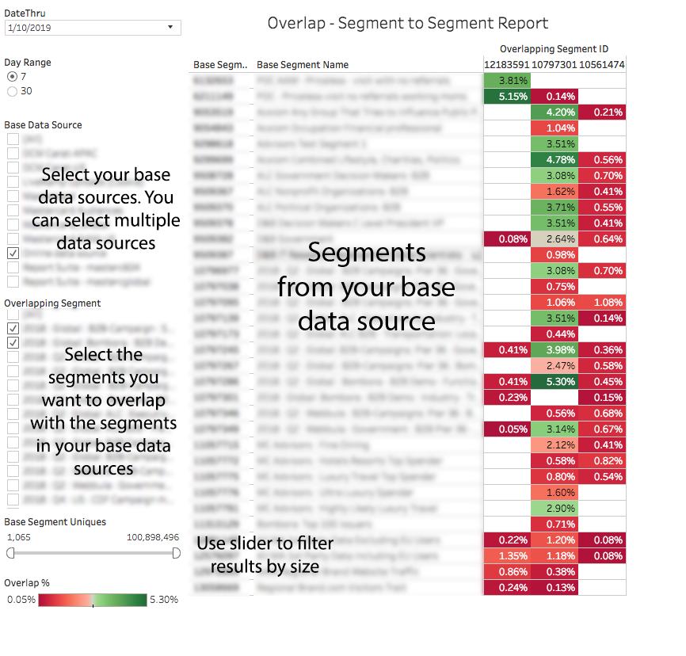

# Rapport de chevauchement de segments à segments{#segment-to-segment-overlap-report}

Renvoie des données sur le nombre d’utilisateurs uniques partagés entre vos segments.

>[!NOTE]
>
>Les rapports de chevauchement dans Audience Manager respectent les principes RBAC. Vous pouvez uniquement afficher les segments des sources de données auxquelles vous avez accès en fonction du [Groupe d’utilisateurs RBAC](/help/using/features/administration/administration-overview.md) auquel vous appartenez.

<!-- 

c_segment_segment_overlap.xml

 -->

## Présentation

Le rapport [!UICONTROL Segment-to-Segment Overlap] peut vous aider à :

* Identifier les segments avec un chevauchement élevé ou faible, selon vos besoins. Les caractéristiques avec un chevauchement élevé vous donnent une audience ciblée, mais moins de visiteurs uniques. Les caractéristiques avec un faible chevauchement peuvent s’avérer utiles pour atteindre un ensemble de visiteurs unique plus vaste.
* Recherchez les chevauchements inattendus et utilisez ces informations pour créer de nouveaux segments hautement performants.

## Exemple de rapport

L’illustration suivante présente de manière générale le rapport [!UICONTROL Segment-to-Segment Overlap].

>[!NOTE]
>
>Le rapport [!UICONTROL Segment-to-Segment Overlap] renvoie un champ vide lorsqu’il compare le même segment à lui-même.

## Accéder à des points de données individuels

Sélectionnez un point individuel pour afficher les détails des données dans une fenêtre pop-up. Les actions de clic mettent automatiquement à jour les données affichées dans le rapport.

## Champs de pop de données de chevauchement de segment à segment définis {#fields-defined}

<!-- 

r_s2s_data_pop.xml

 -->

La fenêtre contextuelle du rapport [!UICONTROL Segment-to-Segment Overlap] contient les mesures ci-dessous. Notez que la mesure uniques du tableau représente vos *utilisateurs en temps réel*.

| Mesure | Description |
|---|---|
| **[!UICONTROL Base Segment ID]** | Identifiant numérique unique du segment qui apparaît dans les résultats du rapport. S’affiche comme l’identifiant de ligne du segment. |
| **[!UICONTROL Base Segment Name]** | Nom du segment qui apparaît dans la ligne des résultats du rapport. |
| **[!UICONTROL Overlapping Segment ID]** | Identifiant numérique unique du segment sélectionné lors de l’exécution du rapport. S’affiche comme l’identifiant de la colonne pour le segment. |
| **[!UICONTROL Overlapping Segment Name]** | Nom du segment sélectionné lors de l’exécution du rapport. Apparaît dans la colonne des résultats du rapport. |
| **[!UICONTROL Base Segment Uniques]** | Nombre de visiteurs et visiteuses uniques dans votre segment de base. |
| **[!UICONTROL Base Segment Uniques]** | Nombre de visiteurs et visiteuses uniques dans votre segment qui se chevauche. |
| **[!UICONTROL Overlapping Uniques]** | Nombre de visiteurs et visiteuses uniques partagés entre les segments comparés. |
| **[!UICONTROL Overlap %]** | Pour obtenir le pourcentage de chevauchement, Audience Manager utilise la formule suivante : Unités de segment de base qui se chevauchent / (Unités de segment de base + Unités de segment qui se chevauchent - Unités qui se chevauchent) |

>[!MORELIKETHIS]
>
>* [Filtrage des résultats du rapport avec les curseurs de données](../../reporting/dynamic-reports/data-sliders.md)
>* [Formes, couleurs et tailles utilisées dans les rapports interactifs](../../reporting/dynamic-reports/interactive-report-technology.md#shapes-colors-sizes)
>* Présentation des icônes et des outils de rapport [&#128279;](../../reporting/dynamic-reports/interactive-report-technology.md#icons-tools-explained)
>* [Rapports de chevauchement : mise à jour des plannings et des tailles de segment minimum](../../reporting/dynamic-reports/overlap-minimum-segment-size.md)
>* [Échantillonnage des données et taux d’erreur dans certains rapports Audience Manager...](../../reporting/report-sampling.md)
>* [Fichiers CSV pour les rapports de chevauchement](../../reporting/dynamic-reports/overlap-csv-files.md)
