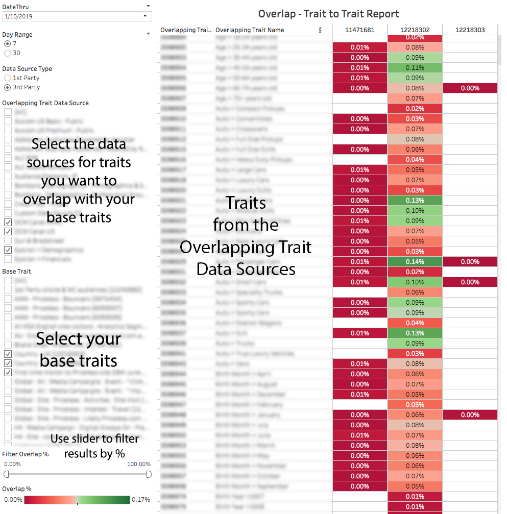

# Rapport de chevauchement de caractéristique à caractéristique{#trait-to-trait-overlap-report}

Renvoie des données sur le nombre d’utilisateurs uniques partagés entre toutes vos caractéristiques premières et tierces.

>[!NOTE]
>
>Les rapports de chevauchement dans Audience Manager respectent les principes RBAC. Vous pouvez uniquement afficher les caractéristiques des sources de données auxquelles vous avez accès en fonction du [groupe d’utilisateurs RBAC](/help/using/features/administration/administration-overview.md) auquel vous appartenez.

<!-- 

c_overlap_reports.xml

 -->

## Présentation

Le rapport [!UICONTROL Trait-to-Trait Overlap] renvoie des données sur le % d’utilisateurs uniques partagés entre toutes vos caractéristiques et vos caractéristiques tierces. En tant qu’outil d’optimisation, ce rapport vous aide à :

* Créez des segments avec un chevauchement élevé ou faible, selon vos besoins. Les caractéristiques avec un chevauchement élevé vous donnent une audience ciblée, mais moins de visiteurs uniques. Les caractéristiques avec un faible chevauchement peuvent s’avérer utiles pour atteindre un ensemble de visiteurs unique plus vaste.
* Valider les données de caractéristiques tierces : un fort chevauchement entre les caractéristiques premières et tierces similaires suggère que la caractéristique de votre partenaire de données est exacte et fiable. À l’inverse, un chevauchement faible peut indiquer qu’une caractéristique tierce peut ne pas contenir les mêmes informations que votre propre caractéristique propriétaire similaire.
* Recherchez les chevauchements inattendus entre les caractéristiques et utilisez ces informations pour créer des segments innovants.

## Exemple de rapport

L’illustration suivante présente de manière générale les éléments du rapport [!UICONTROL Trait-to-Trait Overlap].

>[!NOTE]
>
>Le rapport [!UICONTROL Trait-to-Trait Overlap] renvoie un champ vide lorsqu’il compare la même caractéristique à lui-même.

>[!NOTE]
>
>Les caractéristiques de dossier ne peuvent pas être comparées dans les rapports de chevauchement des caractéristiques. En créant un segment à l’aide d’une caractéristique de dossier particulière, vous pouvez effectuer une analyse via le [&#x200B; rapport de chevauchement segment-à-caractéristique &#x200B;](/help/using/reporting/dynamic-reports/segment-trait-overlap-report.md).

## Accéder à des points de données individuels

Sélectionnez un point individuel pour afficher les détails des données dans une fenêtre pop-up. Les actions de clic mettent automatiquement à jour les données affichées dans le rapport.

## Champs de points de données de chevauchement de caractéristique à caractéristique définis {#field-definitions}

Décrit les mesures affichées dans la fenêtre contextuelle lorsque vous cliquez sur un point de données individuel.

<!-- 

r_t2t_data_pop.xml

 -->

La fenêtre contextuelle du rapport [!UICONTROL Trait-to-Trait Overlap] contient les mesures ci-dessous. Notez que la mesure uniques du tableau représente vos *utilisateurs en temps réel*.

<table id="table_A2A0CFC47C1A404994B82E6630E711A2"> 
 <thead> 
  <tr> 
   <th colname="col1" class="entry"> Mesure </th> 
   <th colname="col2" class="entry"> Description </th> 
  </tr>
 </thead>
 <tbody> 
  <tr> 
   <td colname="col1"><b> Recouvrement %</b> </td> 
   <td colname="col2"> Affiche le % de chevauchement unique entre les caractéristiques comparées (chevauchement uniques/caractéristique unique). </td> 
  </tr> 
  <tr> 
   <td colname="col1"><b> type de Source de données</b> </td> 
   <td colname="col2">Définit le type de source de données auquel appartient une caractéristique. Peut être : 
    <ul id="ul_0477C04A33FD4F5D998B98984E6554D3"> 
     <li id="li_50FCA48EDB5843AB8FB6C34ED2C0067D">Propriétaire (votre propre caractéristique). </li> 
     <li id="li_4F6148EDAEFE43FA8D505944E9FE3855">Tiers (partenaires/fournisseurs de données externes). </li> 
    </ul> </td> 
  </tr> 
  <tr> 
   <td colname="col1"><b> ID de caractéristique avec chevauchement</b> </td> 
   <td colname="col2"> Identifiant numérique unique de la caractéristique qui se chevauche. </td> 
  </tr> 
  <tr> 
   <td colname="col1"><b> nom de caractéristique qui se chevauche</b> </td> 
   <td colname="col2"> Nom de la caractéristique qui se chevauche. </td> 
  </tr>
    <tr> 
   <td colname="col1">ID de caractéristique <b> 2</b> </td> 
   <td colname="col2"> ID numérique unique de la caractéristique dans votre source de données de base. </td> 
  </tr> 
  <tr> 
   <td colname="col1">Nom de caractéristique <b> 2</b> </td> 
   <td colname="col2"> Nom de la caractéristique dans la source de données de base. </td> 
  </tr> 
  <tr> 
   <td colname="col1"><b> les uniques de chevauchement</b> </td> 
   <td colname="col2"> 
Pour obtenir le pourcentage de chevauchement, Audience Manager utilise la formule suivante :
 
Chevauchement des Uniques / (Caractéristiques de base uniques + Caractéristiques uniques avec chevauchement - Caractéristiques uniques avec chevauchement)
 </td> 
  </tr> 
  <tr> 
   <td colname="col1"><b> caractéristiques uniques qui se chevauchent</b> </td> 
   <td colname="col2"> Nombre de visiteurs et visiteuses uniques provenant de la caractéristique de chevauchement. </td> 
  </tr> 
    <tr> 
   <td colname="col1"><b> des caractéristiques de base uniques</b> </td> 
   <td colname="col2"> Nombre de visiteurs et visiteuses uniques provenant de la caractéristique de base. </td> 
  </tr> 
 </tbody> 
</table>

>[!MORELIKETHIS]
>
>* [Filtrage des résultats du rapport avec les curseurs de données](../../reporting/dynamic-reports/data-sliders.md)
>* [Formes, couleurs et tailles utilisées dans les rapports dynamiques](../../reporting/dynamic-reports/interactive-report-technology.md#shapes-colors-sizes)
>* Présentation des icônes et des outils de rapport [&#128279;](../../reporting/dynamic-reports/interactive-report-technology.md#icons-tools-explained)
>* [Rapports de chevauchement : mise à jour des plannings et des tailles de segment minimum](../../reporting/dynamic-reports/overlap-minimum-segment-size.md)
>* [Échantillonnage des données et taux d’erreur dans certains rapports Audience Manager...](../../reporting/report-sampling.md)
>* [Fichiers CSV pour les rapports de chevauchement](../../reporting/dynamic-reports/overlap-csv-files.md)
