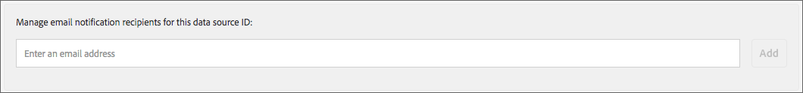

# Rapport État de l’intégration{#onboarding-status-report-about}

Le rapport État de l’intégration vérifie les taux de réussite et d’échec du traitement des enregistrements dans vos fichiers de source de données entrants. Ce rapport affiche les données dans un graphique à barres interactif et fournit des mesures récapitulatives sous forme de tableau. Il comporte également une option qui échantillonne les fichiers pendant une période fixe et affiche les erreurs les plus courantes pour chaque type d’erreur. Ce rapport est disponible dans Analytics &gt; Rapport d’état de l’intégration. Ce rapport est également disponible lorsque vous créez une source de données entrantes.

>[!NOTE]
>
>Seuls les utilisateurs disposant de privilèges d’administrateur peuvent afficher ce rapport dans l’interface utilisateur d’Audience Manager. Vous pouvez faire en sorte que les utilisateurs non administrateurs soient informés de l’état des fichiers entrants téléchargés en ajoutant leurs courriers électroniques au rapport. Voir [Recevoir des notifications](/help/using/reporting/onboarding-status-report.md#receive-email-notifications)par courrier électronique.

##  Rapport d'état d'intégration : À propos de {#onboarding-status-about}

The [!UICONTROL Onboarding Status Report] checks success and failure rates for processing records in your inbound data source files. Ce rapport affiche les données dans un graphique à barres interactif et fournit des mesures récapitulatives sous forme de tableau. Il comporte également une option qui échantillonne les fichiers pendant une période fixe et affiche les erreurs les plus courantes pour chaque type d’erreur. Vous pouvez trouver ce rapport dans **[!UICONTROL Analytics > Onboarding Status Report]**. Ce rapport est également disponible lorsque vous créez une source de données entrantes.

## Rapports d’erreurs et échantillonnage d’erreurs {#error-reporting-sampling}

Les rapports d’erreur et l’échantillonnage des erreurs sont deux fonctionnalités distinctes du [!UICONTROL Onboarding Status] rapport.

<table id="table_4706D891D4C545E8BF9D8A0CC052CC48"> 
 <thead> 
  <tr> 
   <th colname="col1" class="entry"> Fonctionnalité </th> 
   <th colname="col2" class="entry"> Description </th> 
  </tr> 
 </thead>
 <tbody> 
  <tr> 
   <td colname="col1"> 
 <b>Rapport d’erreurs</b> 
 </td>
   <td colname="col2"> 
La création de rapports d’erreurs montre les taux de réussite et d’échec du nombre d’enregistrements traités dans une source de données entrante. Il renvoie les données dans un graphique à barres empilées interactif et sous forme de mesures de résumé dans les tableaux situés sous le graphique. 
 
La création de rapports d’erreur est automatique. Il s’exécute en permanence pour toutes vos sources de données entrantes. Elle renvoie des données en fonction de la plage d’intervalles de temps prédéfinis ou d’un intervalle de temps personnalisé que vous avez défini avec un widget de calendrier. 
 </td> 
  </tr> 
  <tr> 
   <td colname="col1"> 
 <b>Echantillonnage des erreurs</b> 
 </td>
   <td colname="col2"> 
L’échantillonnage des erreurs analyse le contenu de vos fichiers de données et renvoie les 10 erreurs les plus courantes pour chaque type d’erreur. Les erreurs dans vos fichiers de données entrants empêchent le traitement d’enregistrements individuels. Utilisez ce rapport comme outil de dépannage pour réduire le nombre d’erreurs de fichier et améliorer les taux de traitement. 
 
Vous devez activer manuellement l’échantillonnage des erreurs. Il s’exécute pendant 14 jours à compter du jour d’activation, puis s’éteint. Vous pouvez réactiver l’échantillonnage des erreurs après l’expiration de l’intervalle de 14 jours. Vous activez l’échantillonnage des erreurs lorsque vous <a href="../features/manage-datasources.md#create-data-source"> créez une source</a> de données entrante ou en cochant la case <b> Echantillonnage</b> d’erreur dans la section Paramètres  de la source de données d’une source de données entrante existante. 
 
L’échantillonnage des erreurs est un processus exigeant sur le plan informatique. Par conséquent, elle ne renvoie que les 10 premières erreurs pour chaque catégorie d’erreur. Il n’est pas conçu pour renvoyer toutes les erreurs contenues dans une source de données entrante. Ces erreurs constituent un échantillon représentatif d’un groupe potentiellement plus important d’erreurs similaires. Examinez l'intégralité du fichier pour connaître les types d'erreurs signalés par ce rapport, reformulez le fichier et envoyez-le à nouveau. 
 
Voir <a href="../integration/sending-audience-data/batch-data-transfer-explained/inbound-file-contents.md"> Contenu du fichier de données entrantes : Syntaxe, Variables et Exemples</a> pour plus d’informations sur la manière de formater correctement un fichier de données pour une source de données entrante. 
 </td> 
  </tr> 
 </tbody> 
</table>

## Graphique à barres de rapport d’erreur {#error-report-bar-chart}

Le rapport d’erreur montre les taux de réussite et d’échec du traitement des enregistrements dans un graphique à barres empilées, comme illustré dans l’exemple suivant. Le graphique est interactif. Le fait de cliquer sur une barre affiche des mesures récapitulatives pour cette journée dans un tableau sous le graphique.

## Tableaux des rapports d’erreur {#error-report-tables}

Le rapport d’erreur affiche des données tabulaires sous le graphique à barres. Le tableau présente les taux de réussite et d’échec, ainsi que les totaux et les pourcentages.

**Enregistrements réussis et échecs**

Cette vue par défaut présente le nombre de fréquences des enregistrements totaux dans votre rapport et inclut une ventilation des erreurs par type d'erreur.

**Totaux et pourcentages**

Cliquez sur **[!UICONTROL Totals & Percentages]** pour connaître le pourcentage de vos fichiers traités avec succès.

## Rapport d’échantillonnage d’erreurs pendant 14 jours {#error-reporting-14-days}

L’échantillonnage des erreurs étant actif, le rapport vous montre les 10 principales erreurs pour chaque type d’erreur. Cliquez sur un bouton de type d’erreur en haut du rapport pour afficher chaque jeu de données échantillonnées.

>[!NOTE]
>
>Le rapport ne met pas en évidence les erreurs d’enregistrement avec cette version actuelle. Pour rechercher et corriger des erreurs de fichier, vous devez consulter les résultats et les comparer aux spécifications de la documentation sur le contenu [du fichier de données](../integration/sending-audience-data/batch-data-transfer-explained/inbound-file-contents.md) entrant.

## Recevoir des notifications par courrier électronique {#receive-email-notifications}

Vous pouvez ajouter les adresses électroniques des destinataires que vous souhaitez être averti de l’état des fichiers entrants téléchargés. Notez que vous pouvez sélectionner différents destinataires pour différentes sources de données.

## Création d’un rapport d’état d’intégration {#create-onboard-status-report}

Un [!UICONTROL Sample Error Report] renvoie le nombre d’enregistrements d’une source de données traités avec succès et le nombre d’échecs. Pour générer un [!UICONTROL Sample Error Report]fichier, procédez comme suit.

<!-- 

create-onboarding-status-report.xml

 -->

1. Allez-y **[!UICONTROL Analytics > Onboarding Status Report]**. Recherchez une source de données ou sélectionnez-en une dans la liste.

2. Sélectionnez une plage de dates. Les options incluent :

   * Ensemble d’intervalles de rapport fixes.
   * Widgets de calendrier qui vous permettent de créer une plage de dates personnalisée.

3. Cliquez sur **[!UICONTROL OK]**.

## Termes et définitions du rapport d’état d’intégration {#report-terms-conditions}

Guide de référence pour les étiquettes et les termes utilisés dans ce rapport.

<table id="table_1D44A2E6B4C847848B818190DD336841"> 
 <thead> 
  <tr> 
   <th colname="col1" class="entry"> Terme </th> 
   <th colname="col2" class="entry"> Définition </th> 
  </tr> 
 </thead>
 <tbody> 
  <tr> 
   <td colname="col1"> 
 <b>Nom du fichier de synchronisation des données</b> 
 </td> 
   <td colname="col2"> 
Répertorie les fichiers qu’  Audience Manager a reçus et traités de votre source de données entrantes sélectionnée. 
 
Le traitement du fichier échoue si le nom du fichier est mal formaté. Les exigences en matière de nom de fichier varient selon la manière dont vous envoyez ces données à  Audience Manager. Les méthodes de remise comprennent  Amazon S3 et FTP. Pour savoir comment nommer vos fichiers, voir : 
 
 
     <ul id="ul_9A32906A14CA41C5AED0E13930DB31BA"> 
      <li id="li_A5A0E6ED711D4002B52092619F87C7D6"> <a href="../integration/sending-audience-data/batch-data-transfer-explained/inbound-s3-filenames.md"> Exigences en matière de nom Amazon S3 pour les fichiers de données entrants </a> </li> 
     </ul> 
 </td> 
  </tr> 
  <tr> 
   <td colname="col1"> 
 <b>Erreurs de format</b> 
 </td> 
   <td colname="col2"> 
Indique le nombre d’enregistrements dont le traitement a échoué car ils ne correspondaient pas à la syntaxe ou aux exigences de formatage. Voir <a href="../integration/sending-audience-data/batch-data-transfer-explained/inbound-file-contents.md"> Contenu du fichier de données entrantes : Syntaxe, Variables et Exemples</a> pour plus d’informations sur la manière de formater vos données. 
 </td> 
  </tr> 
  <tr> 
   <td colname="col1"> 
 <b>ID AAM non valide</b> 
 </td> 
   <td colname="col2"> 
Répertorie le nombre d’ID utilisateur  d’Audience Manager (UUID) mal formatés. En général, cela indique les ID : 
 
    <ul id="ul_8304250E8F0F44918A50CF9D8D8D1F83"> 
     <li id="li_B100B4C2623B4E099E022869A4978357">Ne correspondait pas au format de 38 chiffres attendu. </li> 
     <li id="li_44E8A9AD13174A20A5742E56ED786634">Contient des caractères alphabétiques. Les identifiants doivent être des nombres uniquement. </li> 
    </ul> </td> 
  </tr>

<tr> 
   <td colname="col1"> 
 <b>ID de périphérique non valide</b> 
 </td> 
   <td colname="col2"> 
Indique le nombre d’ID de périphérique global mal formatés. Voir <a href="../reference/ids-in-aam.md">Index des ID dans Audience Manager</a> et Sources <a href="../features/global-data-sources.md">de données</a> globales pour plus d’informations sur la manière dont les ID de périphérique doivent être formatés et sur les sources de données globales à utiliser, en fonction du type de périphérique.

  
La section d’échantillonnage des erreurs du rapport contient des informations détaillées sur les ID de périphérique non valides, telles que :

   <ul>
    <li>ID de source de données correspondant à l'ID de périphérique non valide;</li>
    <li>ID de périphérique non valide;</li>
    <li>Type d’ID de périphérique attendu, en fonction de la source de données.</li>
   </ul>
  </tr>

<tr> 
   <td colname="col1"> 
 <b>Aucun ID AAM correspondant</b> 
 </td> 
   <td colname="col2"> 
Il s’agit d’identifiants intégrés  Audience Manager ne pouvant pas correspondre à un ID existant. Les identifiants intégrés peuvent avoir cet état lorsque  Audience Manager n’a pas encore effectué de synchronisation des identifiants ou qu’il ne peut toujours pas correspondre à l’identifiant même après une synchronisation. 
 
Dans le cas d’identifiants mobiles inégalés,  Audience Manager : 
 
    <ul id="ul_B0D6AF9EB27D4017B35E36824B403879"> 
     <li id="li_D141000A50D3463182CBA4571DCC5373">Continuez à stocker cet ID et essayez de le synchroniser. </li> 
     <li id="li_2EFCEE716F254ABCBC5FBF749B7564E6">Enregistrez-le comme enregistrement  stocké dans le rapport si l’ID ne peut pas être synchronisé. </li> 
    </ul> 
Si votre fichier intégré contient des identifiants mobiles, vous pouvez traiter ces nombres un peu plus légèrement que les autres mesures. Elles n’affectent pas les taux de réussite et de correspondance des fichiers suivants. 
 </td> 
  </tr> 
  <tr> 
   <td colname="col1"> 
 <b>Aucune caractéristique réalisée</b> 
 </td> 
   <td colname="col2"> 
Répertorie les caractéristiques qu’Audience Manager  ne peut pas faire correspondre à une caractéristique intégrée. Cela pourrait être le résultat de : 
 
    <ul id="ul_43619035AB6641B6949302FB50BDB5B1"> 
     <li id="li_D4C6306BF2B143198108702B309CE8CF">Caractéristiques mal formatées dans le fichier de données entrant. Pour savoir comment formater votre fichier de données, voir <a href="../integration/sending-audience-data/batch-data-transfer-explained/inbound-file-contents.md"> Contenu du fichier de données entrantes : Syntaxe, Variables et Exemples</a>. </li> 
     <li id="li_A1C708A007D24EE09B7C629AFC6E43C3">Caractéristiques qui n’ont pas encore été définies dans  Audience Manager. </li> 
    </ul> </td> 
  </tr> 
  <tr> 
   <td colname="col1"> 
 <b>Pourcentage de réussite</b> 
 </td> 
   <td colname="col2"> 
Pourcentage d’enregistrements dans votre fichier qui ont été stockés avec succès. Pourcentage de succès = enregistrements traités / nombre d’enregistrements dans un fichier. 
 </td> 
  </tr> 
  <tr> 
   <td colname="col1"> 
 <b>Enregistrements reçus</b> 
 </td> 
   <td colname="col2"> 
Nombre total d’enregistrements reçus. Dans la plupart des cas, ce nombre doit correspondre au nombre total d’enregistrements (lignes) dans votre fichier de données entrant. 
 </td> 
  </tr> 
  <tr> 
   <td colname="col1"> 
 <b>Enregistrements stockés</b> 
 </td> 
   <td colname="col2"> 
Nombre d'enregistrements stockés avec succès. En raison d’erreurs de format de fichier, certains enregistrements reçus peuvent ne pas être stockés par  Audience Manager. Le nombre d'enregistrements stockés peut être inférieur au nombre d'enregistrements reçus. 
 </td> 
  </tr> 
  <tr> 
   <td colname="col1"> 
 <b>Nombre total de visites réalisées</b> 
 </td> 
   <td colname="col2"> 
Nombre de caractéristiques pour tous les utilisateurs de tous les fichiers entrants stockés dans la plate-forme  Audience Manager . 
 </td> 
  </tr> 
  <tr> 
   <td colname="col1"> 
 <b>Total des signaux inutilisés</b> 
 </td> 
   <td colname="col2"> 
Nombre total de signaux inutilisés reçus dans le rapport. Ce total est basé sur le nombre total d’enregistrements enregistrés avec succès. 
 
Voir Rapport <a href="../reporting/dynamic-reports/unused-signals.md"> Signaux</a> inutilisés pour en savoir plus. 
 </td> 
  </tr> 
 </tbody> 
</table>
