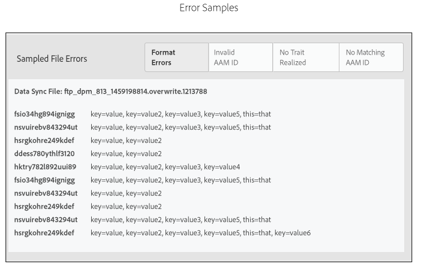

# Rapport d’état d’intégration{#onboarding-status-report-about}

Le rapport État de l’intégration vérifie les taux de succès et d’échec du traitement des enregistrements dans vos fichiers de source de données entrants. Ce rapport affiche les données sous forme d’un graphique à barres interactif et fournit des mesures récapitulatives sous forme de tableau. Elle comprend également une option qui échantillonne les fichiers pour un intervalle de temps fixe et affiche les erreurs les plus courantes pour chaque type d’erreur. Ce rapport est disponible dans Analytics > Rapport État de l’intégration . Ce rapport est également disponible lorsque vous créez une source de données entrante.

>[!NOTE]
>
>Seuls les utilisateurs disposant de droits d’administrateur peuvent afficher ce rapport dans l’interface utilisateur de l’Audience Manager. Vous pouvez demander aux utilisateurs non-administrateurs d’être informés de l’état des fichiers entrants transférés en ajoutant leurs emails au rapport. Voir [Recevoir des notifications par courrier électronique](/help/using/reporting/onboarding-status-report.md#receive-email-notifications).

## Rapport État de l’intégration : À propos {#onboarding-status-about}

Le [!UICONTROL Onboarding Status Report] vérifie les taux de succès et d’échec du traitement des enregistrements dans vos fichiers de source de données entrants. Ce rapport affiche les données sous forme d’un graphique à barres interactif et fournit des mesures récapitulatives sous forme de tableau. Elle comprend également une option qui échantillonne les fichiers pour un intervalle de temps fixe et affiche les erreurs les plus courantes pour chaque type d’erreur. Vous pouvez trouver ce rapport dans **[!UICONTROL Analytics > Onboarding Status Report]**. Ce rapport est également disponible lorsque vous créez une source de données entrante.

## Rapport d’erreurs et échantillonnage d’erreurs {#error-reporting-sampling}

Les rapports d’erreur et l’échantillonnage des erreurs sont deux fonctionnalités distinctes du rapport [!UICONTROL Onboarding Status].

<table id="table_4706D891D4C545E8BF9D8A0CC052CC48"> 
 <thead> 
  <tr> 
   <th colname="col1" class="entry"> Fonctionnalité </th> 
   <th colname="col2" class="entry"> Description </th> 
  </tr> 
 </thead>
 <tbody> 
  <tr> 
   <td colname="col1"> 
 <b>Rapport d’erreurs</b> 
 </td>
   <td colname="col2"> 
Le rapport d’erreurs vous indique les taux de succès et d’échec du nombre d’enregistrements traités dans une source de données entrante. Elle renvoie les données dans un graphique à barres interactif et empilé et sous forme de mesures de résumé dans les tableaux situés sous le graphique. 
 
Le rapport d’erreurs est automatique. Il s’exécute en continu pour toutes vos sources de données entrantes. Elle renvoie des données en fonction d’intervalles de temps prédéfinis ou d’un intervalle de temps personnalisé que vous avez défini avec un widget de calendrier. 
 </td> 
  </tr> 
  <tr> 
   <td colname="col1"> 
 <b>Échantillonnage d’erreurs</b> 
 </td>
   <td colname="col2"> 
L’échantillonnage d’erreurs analyse le contenu de vos fichiers de données et renvoie les 10 erreurs les plus courantes pour chaque type d’erreur. Les erreurs de vos fichiers de données entrants empêchent le traitement des enregistrements individuels. Utilisez ce rapport comme outil de dépannage pour réduire le nombre d’erreurs de fichier et améliorer les taux de traitement. 
 
Vous devez activer manuellement l’échantillonnage des erreurs. Il s’exécute pendant 14 jours à compter du jour de l’activation, puis s’éteint. Vous pouvez réactiver l’échantillonnage d’erreurs après l’expiration de l’intervalle de 14 jours. Vous activez l’échantillonnage d’erreurs lorsque vous <a href="../features/manage-datasources.md#create-data-source"> créez une source de données entrante</a> ou en cochant la case <b> Échantillonnage d’erreurs</b> de la section  Paramètres de Source de données d’une source de données entrante existante. 
 
L’échantillonnage d’erreurs est un processus exigeant en calcul. Par conséquent, elle ne renvoie que 10 premières erreurs pour chaque catégorie d’erreur. Il n’est pas conçu pour renvoyer toutes les erreurs contenues dans une source de données entrante. Ces erreurs constituent un exemple représentatif d’un groupe potentiellement plus important d’erreurs similaires. Recherchez dans votre fichier entier les types d’erreurs que ce rapport signale, reformétez le fichier et renvoyez-le. 
 
Voir <a href="../integration/sending-audience-data/batch-data-transfer-explained/inbound-file-contents.md"> Contenu du fichier de données entrant : syntaxe, variables et exemples</a> pour plus d’informations sur la manière de formater correctement un fichier de données pour une source de données entrante. 
 </td> 
  </tr> 
 </tbody> 
</table>

## Graphique à barres de rapports des erreurs {#error-report-bar-chart}

Le rapport d’erreur affiche les taux de succès et d’échec du traitement des enregistrements dans un graphique à barres empilées, comme illustré dans l’exemple suivant. Le graphique est interactif. Cliquez sur une barre pour afficher les mesures récapitulatives pour cette journée dans un tableau sous le graphique.

## Tableaux de rapport d’erreurs {#error-report-tables}

Le rapport d’erreur affiche les données tabulaires sous le graphique à barres. Le tableau affiche les taux de succès et d’échec, ainsi que les totaux et les pourcentages.

**Enregistrements réussis et échoués**

Cette vue par défaut affiche le nombre de fréquences des enregistrements totaux dans votre rapport et inclut une ventilation des erreurs par type d&#39;erreur.

**Totaux et pourcentages**

Cliquez sur **[!UICONTROL Totals & Percentages]** pour voir quel pourcentage de vos fichiers a été traité avec succès.

## Rapport d’échantillonnage d’erreurs pendant 14 jours {#error-reporting-14-days}

Lorsque l’échantillonnage d’erreurs est actif, le rapport affiche les 10 premières erreurs pour chaque type d’erreur. Cliquez sur un bouton de type erreur dans la partie supérieure du rapport pour afficher chaque jeu de données échantillonnées.

>[!NOTE]
>
>Le rapport ne met pas en évidence d’erreurs d’enregistrement avec cette version actuelle. Pour rechercher et corriger les erreurs de fichier, vous devez consulter les résultats et les comparer aux spécifications de la documentation [Contenu du fichier de données entrant](../integration/sending-audience-data/batch-data-transfer-explained/inbound-file-contents.md).

## Réception de notifications par courrier électronique {#receive-email-notifications}

Vous pouvez ajouter les adresses email des destinataires que vous souhaitez avertir de l&#39;état des fichiers entrants chargés. Notez que vous pouvez sélectionner différents destinataires pour différentes sources de données.

## Création d’un rapport d’état d’intégration {#create-onboard-status-report}

Un [!UICONTROL Sample Error Report] renvoie le nombre d’enregistrements d’une source de données traités avec succès et le nombre d’échecs. Suivez ces étapes pour générer un [!UICONTROL Sample Error Report].

<!-- 

create-onboarding-status-report.xml

 -->

1. Accédez à **[!UICONTROL Analytics > Onboarding Status Report]**. Recherchez une source de données ou sélectionnez-en une dans la liste.

2. Sélectionnez une plage de dates. Les options incluent :

   * Ensemble d’intervalles de rapport fixes.
   * Widgets de calendrier qui vous permettent de créer une période personnalisée.

3. Cliquez sur **[!UICONTROL OK]**.

## Termes et définitions des rapports d’état d’intégration {#report-terms-conditions}

Un guide de référence pour les libellés et les termes utilisés dans ce rapport.

<table id="table_1D44A2E6B4C847848B818190DD336841"> 
 <thead> 
  <tr> 
   <th colname="col1" class="entry"> Terme </th> 
   <th colname="col2" class="entry"> Définition </th> 
  </tr> 
 </thead>
 <tbody> 
  <tr> 
   <td colname="col1"> 
 <b>Nom de fichier de synchronisation des données</b> 
 </td> 
   <td colname="col2"> 
Répertorie les fichiers que l’  Audience Manager a reçus et traités de la source de données entrante sélectionnée. 
 
Le traitement des fichiers échoue si le nom de fichier n’est pas correctement formaté. Les exigences en matière de nom de fichier varient selon la manière dont vous envoyez ces données à l’  Audience Manager. Les méthodes de diffusion incluent  Amazon S3 et FTP. Pour plus d’informations sur le nom de vos fichiers, voir : 
 
 
     <ul id="ul_9A32906A14CA41C5AED0E13930DB31BA"> 
      <li id="li_A5A0E6ED711D4002B52092619F87C7D6"> <a href="../integration/sending-audience-data/batch-data-transfer-explained/inbound-s3-filenames.md"> Exigences en matière de nom Amazon S3 pour les fichiers de données entrants </a> </li> 
     </ul> 
 </td> 
  </tr> 
  <tr> 
   <td colname="col1"> 
 <b>Erreurs de format</b> 
 </td> 
   <td colname="col2"> 
Répertorie le nombre d’enregistrements dont le traitement a échoué car ils ne correspondaient pas à la syntaxe ou aux exigences de formatage. Voir <a href="../integration/sending-audience-data/batch-data-transfer-explained/inbound-file-contents.md"> Contenu du fichier de données entrant : syntaxe, variables et exemples</a> pour plus d’informations sur la manière de formater vos données. 
 </td> 
  </tr> 
  <tr> 
   <td colname="col1"> 
 <b>ID d’AAM non valide</b> 
 </td> 
   <td colname="col2"> 
Répertorie le nombre d'identifiants utilisateur  d'Audience Manager  mal formatés (UUID). En règle générale, cela indique les identifiants : 
 
    <ul id="ul_8304250E8F0F44918A50CF9D8D8D1F83"> 
     <li id="li_B100B4C2623B4E099E022869A4978357">Ne correspondait pas au format de 38 chiffres attendu. </li> 
     <li id="li_44E8A9AD13174A20A5742E56ED786634">Contient des caractères alphabétiques. Les identifiants doivent être des nombres uniquement. </li> 
    </ul> </td> 
  </tr>

<tr> 
   <td colname="col1"> 
 <b>ID d’appareil non valide</b> 
 </td> 
   <td colname="col2"> 
Répertorie le nombre d’identifiants d’appareils globaux mal formatés. Voir <a href="../reference/ids-in-aam.md">Index des identifiants en Audience Manager</a> et <a href="../features/global-data-sources.md">Sources de données globales</a> pour plus d’informations sur la manière dont les identifiants d’appareil doivent être formatés et sur les sources de données globales que vous devez utiliser, en fonction du type d’appareil.

  
La section d’échantillonnage d’erreurs du rapport contient des informations détaillées sur les identifiants d’appareil non valides, telles que :

   <ul>
    <li>L’identifiant de source de données correspondant à l’identifiant d’appareil non valide ;</li>
    <li>ID d’appareil non valide ;</li>
    <li>Type d’identifiant d’appareil attendu, en fonction de la source de données.</li>
   </ul>
  </tr>

<tr> 
   <td colname="col1"> 
 <b>Aucun identifiant d’AAM correspondant</b> 
 </td> 
   <td colname="col2"> 
Il s’agit d’identifiants intégrés  et l’Audience Manager  ne peut pas correspondre à un identifiant existant. Les identifiants intégrés peuvent avoir cet état lorsque  Audience Manager n’a pas encore effectué de synchronisation des identifiants ou qu’il ne peut toujours pas correspondre à l’identifiant même après une synchronisation. 
 
Dans le cas d'identifiants mobiles sans correspondance,  Audience Manager : 
 
    <ul id="ul_B0D6AF9EB27D4017B35E36824B403879"> 
     <li id="li_D141000A50D3463182CBA4571DCC5373">Continuez à stocker et à essayer de synchroniser cet identifiant. </li> 
     <li id="li_2EFCEE716F254ABCBC5FBF749B7564E6">Enregistrez-le comme  Enregistrement stocké dans le rapport si l’ID ne peut pas être synchronisé. </li> 
    </ul> 
Si votre fichier intégré contient des identifiants mobiles, vous pouvez traiter ces nombres un peu plus à la légère que les autres mesures. Elles n’affecteront pas le succès et les taux de correspondance des fichiers suivants. 
 </td> 
  </tr> 
  <tr> 
   <td colname="col1"> 
 <b>Aucune caractéristique réalisée</b> 
 </td> 
   <td colname="col2"> 
Répertorie les caractéristiques que  Audience Manager ne peut pas correspondre à une caractéristique intégrée. Cela peut être le résultat de : 
 
    <ul id="ul_43619035AB6641B6949302FB50BDB5B1"> 
     <li id="li_D4C6306BF2B143198108702B309CE8CF">Caractéristiques mal formatées dans votre fichier de données entrant. Pour savoir comment formater votre fichier de données, voir <a href="../integration/sending-audience-data/batch-data-transfer-explained/inbound-file-contents.md"> Contenu du fichier de données entrant : syntaxe, variables et exemples</a>. </li> 
     <li id="li_A1C708A007D24EE09B7C629AFC6E43C3">Caractéristiques qui n’ont pas encore été définies dans l’  Audience Manager. </li> 
    </ul> </td> 
  </tr> 
  <tr> 
   <td colname="col1"> 
 <b>Pourcentage de succès</b> 
 </td> 
   <td colname="col2"> 
Le pourcentage d’enregistrements dans votre fichier qui ont été stockés avec succès. Pourcentage de succès = enregistrements traités / nombre d'enregistrements dans un fichier. 
 </td> 
  </tr> 
  <tr> 
   <td colname="col1"> 
 <b>Enregistrements reçus</b> 
 </td> 
   <td colname="col2"> 
Nombre total d’enregistrements reçus. Dans la plupart des cas, ce nombre doit correspondre au nombre total d'enregistrements (lignes) dans votre fichier de données entrant. 
 </td> 
  </tr> 
  <tr> 
   <td colname="col1"> 
 <b>Enregistrements stockés</b> 
 </td> 
   <td colname="col2"> 
Nombre d'enregistrements stockés avec succès. En raison d’erreurs de format de fichier, certains enregistrements reçus peuvent ne pas être stockés par l’Audience Manager . Le nombre d'enregistrements stockés peut être inférieur au nombre d'enregistrements reçus. 
 </td> 
  </tr> 
  <tr> 
   <td colname="col1"> 
 <b>Total des caractéristiques traduites</b> 
 </td> 
   <td colname="col2"> 
Le nombre de caractéristiques pour tous les utilisateurs sur tous les fichiers entrants stockés dans la plateforme  Audience Manager. 
 </td> 
  </tr> 
  <tr> 
   <td colname="col1"> 
 <b>Total des signaux inutilisés</b> 
 </td> 
   <td colname="col2"> 
Nombre total de signaux inutilisés reçus dans le rapport. Ce total est basé sur le nombre total d’enregistrements stockés avec succès. 
 
Pour plus d’informations, voir <a href="../reporting/dynamic-reports/unused-signals.md"> Rapport de signaux inutilisés </a> . 
 </td> 
  </tr> 
 </tbody> 
</table>
