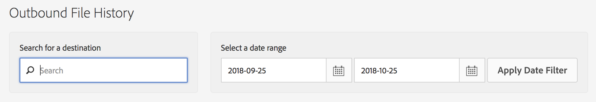
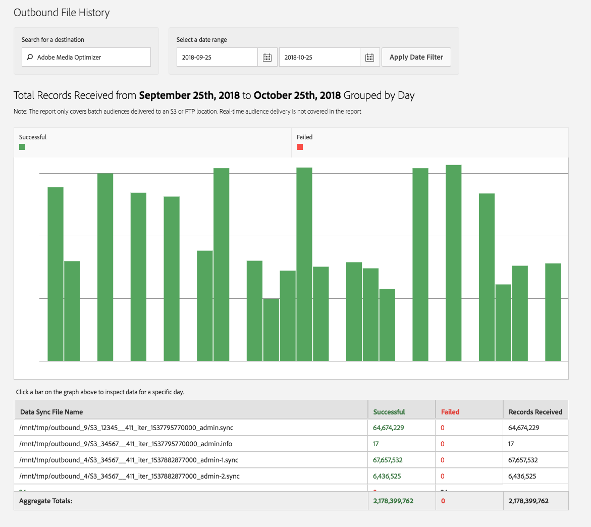

# Historique des fichiers sortants {#outbound-file-history}

Affichez les informations d’historique des traitements par lots sortants pour une destination et une période spécifiées.

<!-- 

t_reports_outbound_history.xml

 -->

1. Cliquez sur **[!UICONTROL Analytics]** > **[!UICONTROL Outbound File History]**.

   

1. Dans la zone de **[!UICONTROL Search for a Destination]**, commencez la saisie et sélectionnez la destination souhaitée.
1. Dans la zone de **[!UICONTROL Select a Date Range]**, indiquez les dates de début et de fin de votre rapport, puis cliquez sur **[!UICONTROL Apply Date Filter]**.

   

   Le tableau suivant contient des informations correspondant aux colonnes du rapport :

<table id="table_93076D46AC50411395E72B9B987E99BE"> 
 <thead> 
  <tr> 
   <th colname="col1" class="entry"> Ligne </th> 
   <th colname="col2" class="entry"> Description </th> 
  </tr> 
 </thead>
 <tbody> 
  <tr> 
   <td colname="col1"> Nom du fichier de synchronisation des données </td> 
   <td colname="col2"> 
Liste de tous les fichiers sortants générés  Adobe pour cette destination et traités ensemble. 
 </td> 
  </tr> 
  <tr> 
   <td colname="col1"> Succès </td> 
   <td colname="col2"> 
Nombre d’enregistrements envoyés avec succès d’ Audience Manager vers la destination. 
 </td> 
  </tr> 
  <tr> 
   <td colname="col1"> Echec </td> 
   <td colname="col2"> 
Nombre d'enregistrements qui n'ont pas pu être envoyés à la destination. 
 </td> 
  </tr> 
  <tr> 
   <td colname="col1"> Enregistrements reçus </td> 
   <td colname="col2"> 
Nombre total d’enregistrements  Adobe générés dans les fichiers et ayant tenté d’être envoyés à la destination. Dans la plupart des cas, il s’agit du nombre total de fichiers réussis et en échec. 
 </td> 
  </tr> 
 </tbody> 
</table>
