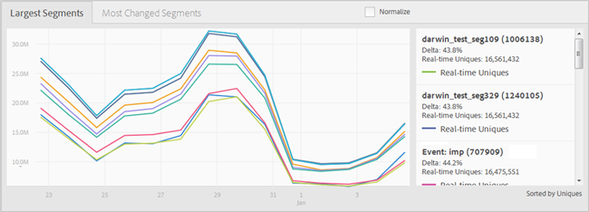

# Tableau de bord de rapports {#reports-dashboard}

Utilisez le tableau de bord pour afficher des informations sur le nombre de visiteurs uniques ventilé par types de caractéristiques et par segments, pour une période spécifiée.

<!-- 

c_dashboard.xml

 -->

[!DNL Audience Manager] utilise  [!UICONTROL Role Based Access Control]  ([!UICONTROL RBAC]) pour étendre les autorisations des groupes d’utilisateurs à  [!UICONTROL Dashboard]. Les utilisateurs ne peuvent afficher que les informations du tableau de bord qu’ils sont autorisés à afficher. [!UICONTROL RBAC] permet de contrôler les données de rapport que les équipes internes peuvent afficher.

Par exemple, une agence qui gère différents comptes publicitaires peut configurer des autorisations de groupe d’utilisateurs de sorte qu’une équipe qui gère le compte de l’annonceur A ne puisse pas consulter les données de rapport de l’annonceur B. Ce tableau de bord peut être utilisé pour résoudre les problèmes de diffusion des données.

Par exemple, si vous constatez une baisse ou un pic du nombre total d’utilisateurs uniques avec la ventilation du type d’utilisateur unique (basé sur des règles ou intégré), vous disposez d’un meilleur point de départ pour détecter un problème potentiel de remise des données. Si vous constatez un creux dans le nombre total d’utilisateurs uniques et d’utilisateurs uniques intégrés, vous pouvez accéder au rapport [!UICONTROL On-boarding Status] pour voir si un problème s’est produit avec un fichier entrant.

**Pour accéder au tableau de bord :**

1. Dans le menu de navigation supérieur, cliquez sur **[!UICONTROL Dashboard]**.
2. ** Facultatif : sélectionnez la période souhaitée à partir de la date du dernier rapport dans la liste déroulante (7 jours, 14 jours (valeur par défaut), 30 jours ou 60 jours).

   Selon la période sélectionnée, le changement différentiel dans les panneaux [!UICONTROL Largest Traits] > [!UICONTROL Most Changed Traits] et [!UICONTROL Largest Segments] > [!UICONTROL Most Changed Segments] affiche le changement dans les visiteurs uniques de l’audience sur la période se terminant aujourd’hui par rapport à la période précédente de même durée. Si, par exemple, vous sélectionnez 7 jours, le delta compare les visiteurs uniques des sept jours se terminant aujourd’hui par rapport aux visiteurs uniques des sept jours se terminant il y a sept jours.

   >[!NOTE]
   >
   >Vous pouvez étudier une modification delta qui semble hors de l’ordinaire en exécutant un rapport [!UICONTROL Trend]. Par exemple, si vous constatez une modification delta inhabituellement importante au cours des sept derniers jours, vous pouvez exécuter un rapport [!UICONTROL Trend] pour les 14 derniers jours (2 x 7) afin de mieux comprendre les chiffres.

   Selon les autorisations de l’utilisateur connecté, les panneaux suivants s’affichent :

   * [Partenaires uniques](../reporting/reports-dashboard.md#partner-uniques)
   * [Caractéristiques les plus grandes/caractéristiques les plus modifiées](../reporting/reports-dashboard.md#largest-traits)
   * [Segments les plus grands/segments les plus modifiés](../reporting/reports-dashboard.md#most-changed-segments)

3. ** FacultatifCliquez  **[!UICONTROL Normalize]** au-dessus d’un graphique pour afficher toutes les données à la même échelle. Vous pouvez également placer le pointeur de la souris sur un point de données pour afficher plus d’informations.

## Partenaires uniques {#partner-uniques}

Autorisation requise pour l’affichage : [!UICONTROL View All Traits].

Ce panneau affiche le nombre de visiteurs uniques au cours de la période spécifiée. Les lignes individuelles codées par couleur représentent le nombre total de visiteurs uniques et le nombre de visiteurs uniques capturés à l’aide de caractéristiques algorithmiques, basées sur des règles et intégrées.

>[!NOTE]
>
>Le nombre total de visiteurs uniques représente les visiteurs capturés au moyen de caractéristiques basées sur des règles ou intégrées. Cependant, le nombre total de visiteurs uniques n’est pas égal à la somme des visiteurs uniques capturés à l’aide des caractéristiques basées sur des règles et intégrées. Un même utilisateur unique peut être représenté dans l’un de ces deux types de caractéristiques.

## Caractéristiques les plus grandes/caractéristiques les plus modifiées {#largest-traits}

Autorisation requise pour l’affichage : [!UICONTROL View Traits].

Ce panneau affiche le nombre de visiteurs uniques capturés par différentes caractéristiques.

Utilisez la liste déroulante **[!UICONTROL Show]** pour afficher des informations sur différents types de caractéristiques : [!UICONTROL All Traits], [!UICONTROL Algorithmic], [!UICONTROL Onboarded] ou [!UICONTROL Rule-Based].

Ce panneau contient les onglets suivants :

<table id="table_DA48BDEB4E0143BEA4EB85AC26FF6AE3"> 
 <thead> 
  <tr> 
   <th colname="col1" class="entry"> Tabulation </th> 
   <th colname="col2" class="entry"> Description </th> 
  </tr> 
 </thead>
 <tbody> 
  <tr> 
   <td colname="col1"> 
 Caractéristiques les plus grandes 
 </td> 
   <td colname="col2"> 
Affiche des informations sur le nombre de visiteurs uniques triés par nombre (du plus élevé au plus faible) et répertorie également le changement différentiel de visiteurs uniques au cours de la période spécifiée. 
 </td> 
  </tr> 
  <tr> 
   <td colname="col1"> 
 Caractéristiques les plus modifiées 
 </td> 
   <td colname="col2"> 
Affiche des informations sur le nombre de visiteurs uniques triés selon le changement différentiel. 
 </td> 
  </tr> 
 </tbody> 
</table>

## Segments les plus grands/segments les plus modifiés {#most-changed-segments}

Autorisation requise pour l’affichage : [!UICONTROL View Segments].

Ce panneau affiche en temps réel le nombre de visiteurs uniques capturés par différents segments.

Ce panneau contient les onglets suivants :

<table id="table_8E22E0579FA74C5A86CC40B40B2548BE"> 
 <thead> 
  <tr> 
   <th colname="col1" class="entry"> Tabulation </th> 
   <th colname="col2" class="entry"> Description </th> 
  </tr> 
 </thead>
 <tbody> 
  <tr> 
   <td colname="col1"> 
 Segments les plus volumineux 
 </td> 
   <td colname="col2"> 
Affiche des informations sur le nombre de visiteurs uniques et le changement différentiel de visiteurs uniques au cours de la période spécifiée. 
 </td> 
  </tr> 
  <tr> 
   <td colname="col1"> 
 Segments les plus modifiés 
 </td> 
   <td colname="col2"> 
Affiche des informations sur le nombre de visiteurs uniques triés selon le changement différentiel. 
 </td> 
  </tr> 
 </tbody> 
</table>
