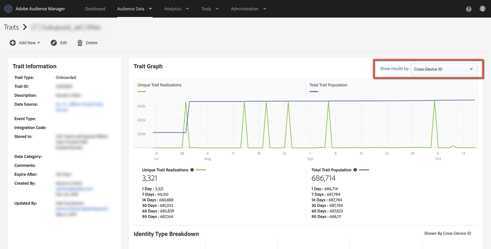

# Pourquoi mes populations de caractéristiques intégrées ont-elles chuté à 0 vers le 15 octobre ? {#why-did-my-onboarded-trait-populations-drop-to-0-around-october}

## Question

Vers le 14 octobre 2019, j&#39;ai remarqué que mes populations de caractéristiques intégrées pour le graphique d&#39;ID de périphérique ont chuté à 0, où elles étaient auparavant beaucoup plus élevées. Pourquoi est-ce arrivé ?

## Réponse

Le 15 octobre, une mise à jour de la fonctionnalité de règle de fusion des Profils de l’Audience Manager a été modifiée afin que les données intégrées conservées d’un ID de gestion de la relation client téléchargé sur une source de données sur plusieurs périphériques ne soient plus réalisées par rapport aux identifiants de périphérique.  Auparavant, l’Audience Manager se réalisait à la fois sur l’ID de plusieurs périphériques (ou l’ID de gestion de la relation client) et sur la copie de ces réalisations sur les UUID d’Audience Manager (ID de périphérique) associés.  Le changement a été apporté afin de refléter plus précisément la nature des données sur les caractéristiques et les profils réalisés.

Pour vue des réalisations de la caractéristique, sélectionnez l’option &quot;ID sur plusieurs périphériques&quot; dans la liste déroulante située dans le coin supérieur droit de la vue de caractéristiques.

